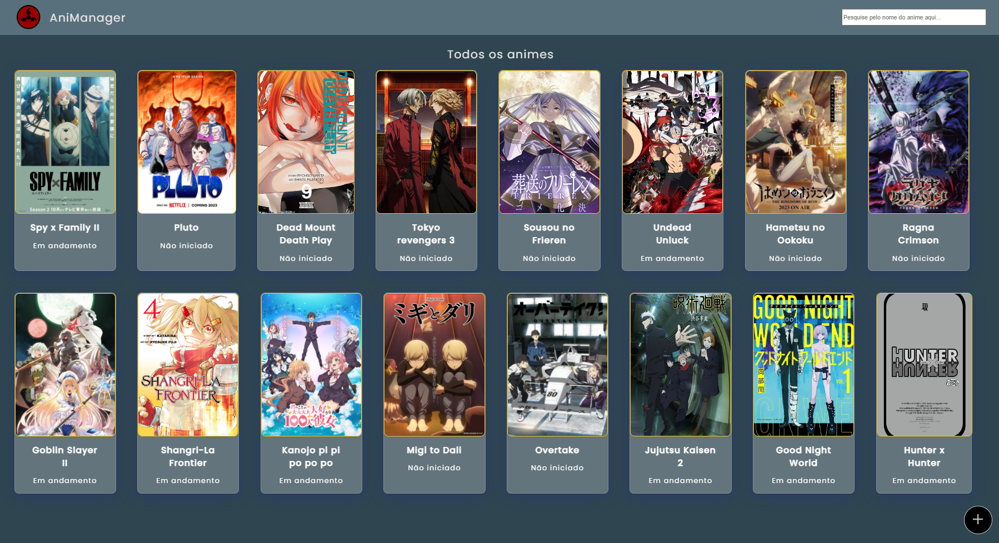

# Anime Manager

- Challenge: Create a website that helps me keep track of the anime I'm currently watching 🌳


## Challenges

- Filter animes by user ✔️
- List all animes, with photo and name and number of episodes watched ✔️
- List animes by progress. Ex: Not started, in progress and finished ✔️
- Possibility to create and update anime infos. ✔️
- Possibility to visualize anime infos ✔️

## Setup

Clone the project

```bash
  git clone https://github.com/otavioaraujo08/anime-manager.git
```

Install dependencies

```bash
  npm install
```

Start database

```bash
  npm run database
```

Start project

```bash
  git clone https://github.com/otavioaraujo08/anime-manager.git
```
    
## Deploy

- It's necessary to start database server to use site functions ( Setup - 3nd instruction )
- https://anime-manager-dev.netlify.app


